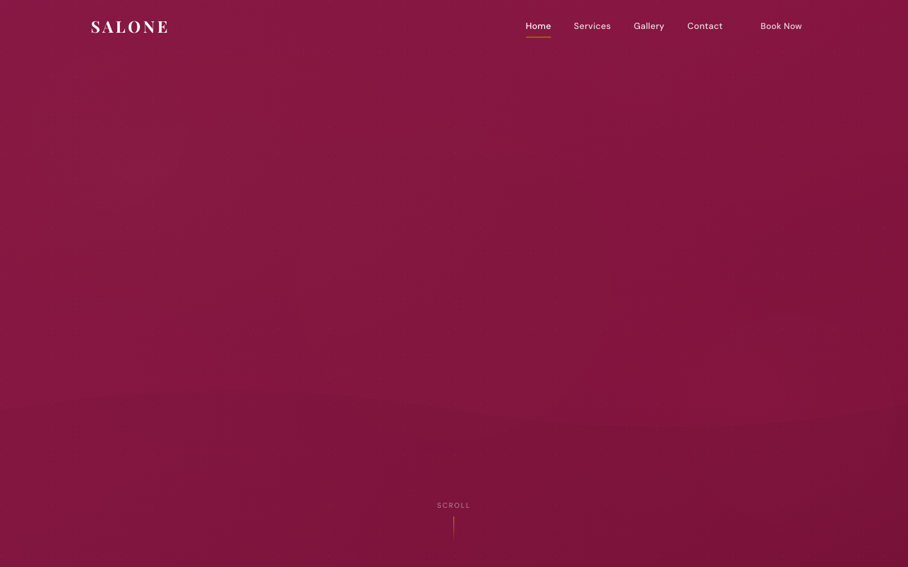

# SALONE — Salon & Beauty HTML Template

A premium, framework-free HTML template for beauty salons, spas, and aesthetic studios. SALONE wraps a rich rose-and-gold palette in elegant Playfair Display serif typography for a warm, luxurious feel that communicates artistry and care.

## 📸 Screenshot

## 🎨 Design System

| Token | Value | Usage |
|-------|-------|-------|
| `--rose` | `#BE185D` | Primary accent, CTAs, logo |
| `--rose-pale` | `#FDF2F8` | Soft backgrounds |
| `--gold` | `#A16207` | Ratings, accents, luxe details |
| `--off-white` | `#FDFBF7` | Page background |
| `--cream` | `#FAF5EE` | Alternate section surfaces |
| `--gray-500` | `#6B7280` | Body text |
| Headings | Playfair Display (400–700) | Elegant serif |
| Body | DM Sans (300–700) | Clean geometric sans |

## 📄 Pages

| Page | Description | Sections |
|------|-------------|----------|
| [index.html](index.html) | Home | Hero slider with parallax, signature services (6), about, testimonials slider, CTA |
| [services.html](services.html) | Full service menu | Hair, skincare, makeup, nails, massage, bridal + consultation CTA |
| [gallery.html](gallery.html) | Work showcase | Filterable gallery, before & after, lightbox |
| [contact.html](contact.html) | Booking / contact | Form (name, email, phone, service, date, message), info card |

## ⚙️ Tech Stack

- **HTML5** — semantic markup, accessibility-first
- **CSS3** — custom properties, Grid, Flexbox, `clamp()`
- **Vanilla JS** — hero slider with autoplay, IntersectionObserver reveals, gallery filters + lightbox, testimonial slider, mobile nav, form validation
- **Fonts** — Google Fonts (Playfair Display + DM Sans)
- No frameworks, no build step, no dependencies

## 📁 Images

All imagery lives in `assets/img/` — 41 files including service icons (haircut, makeup, manicure, massage, pedicure, skin-care), hero slider shots, gallery (8), team portraits, testimonials, and SVG backgrounds.

---

**Template by uiuxlabz** — framework-free, responsive, production-ready.

### Let's Build Something Together 🚀

[https://tally.so/r/q4q1L9](https://tally.so/r/q4q1L9)
